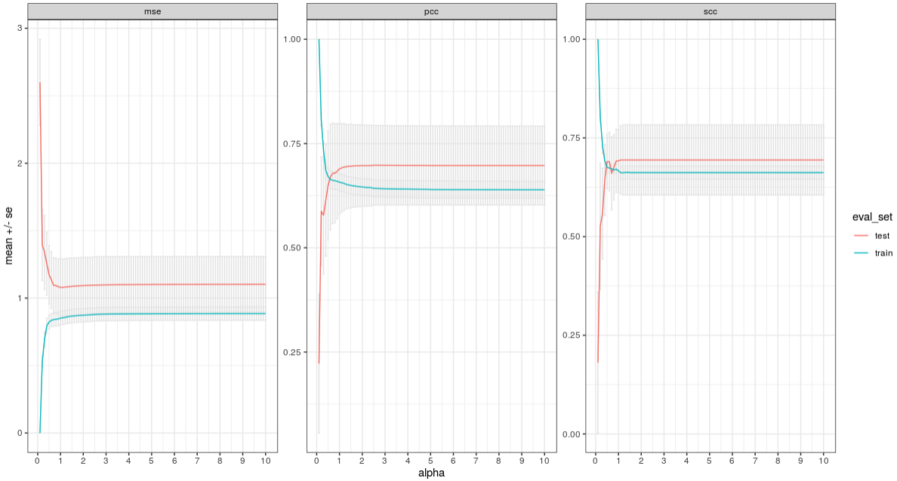
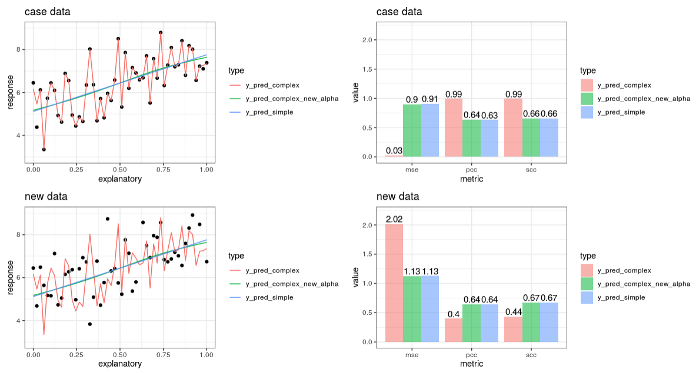

```{r setup, include=FALSE}
knitr::opts_chunk$set(echo = FALSE)
```

## A Case Story Recap

```{r, out.width = "1000px", fig.align="center"}

```

## A Case Story Recap

```{r, out.width = "1000px", fig.align="center"}

```

## Summary

- ANNs are
    - Able to capture higher order correlations and context dependence
    - Universal approximaters
    - Extremely powerful in predictive modelling
    - Prone to overfitting

- I hope you are leaving the workshop today with a better understanding of ANNs, Keras and TensorFlow

- I will leave the workshop github repo as is, so please feel free to revisit later

## A few tips, tricks and words of advice...

- Be sure, that you “need” Deep Learning
- Create a base learner using a simple approach, e.g. linear- or logistic regression model
- Up the complexicity with e.g. a random forest model
- Do a simple neural network, e.g. 1 input, 1 hidden and 1 output
- Go full deep learning
- Record the performance in each of the steps
- If you max out using a logistic regression, then proceed no further
- Be aware that what you gain in performance, you may loose in model interpretability
- Be very careful with overfitting, a predictive model only works, if it can actually extrapolate on unseen data
- Check your data and partitions prior to modelling, sparsity, order, balance, etc.

## Closing Remarks
- TensorFlow for R is extremely powerful and flexible and allows you to create and deploy complex models in a relatively simple fashion

- Model building ends up being not about the code, but about mapping your problem and the data and the tools you have together to get a good solution

- The hard part about deep learning is not generally writing the code, the hard part is figuring out what sort of model to build, i.e. architecture and hyper paremeters, that's where all the time is spend!

- I hope you got a feeling for that at my workshop today!

#

```{r, out.width = "500px", fig.align="center"}
knitr::include_graphics("img/no_scream.png")
```

# Q&A
